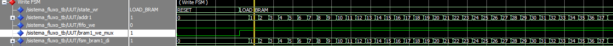
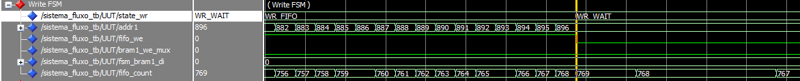
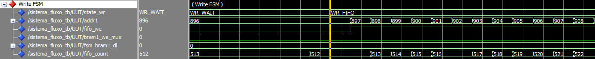
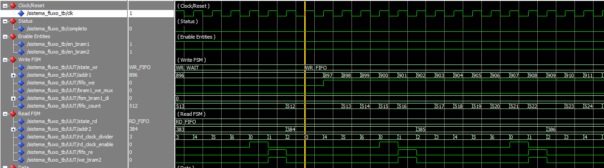
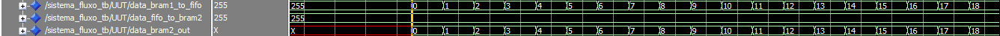
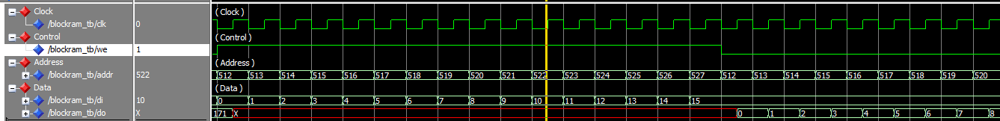
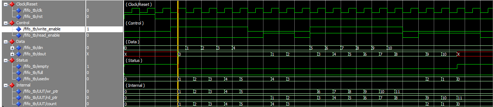

# Logica-Reconfiguravel
Jean Carlos do Nascimento Cunha

# Relatório: Controle de Fluxo BRAM-FIFO-BRAM

## 1. Objetivo
Exercitar o controle de fluxo de dados entre elementos de lógica reconfigurável. O sistema preenche uma BRAM (2048x8) com valores consecutivos e os transfere para uma FIFO (1024), que por sua vez escreve em uma segunda BRAM. A escrita na FIFO ocorre a uma velocidade 7 vezes maior que a leitura.

## 2. Detalhes de Implementação
O projeto foi desenvolvido em VHDL com arquitetura estrutural, instanciando os componentes `BlockRAM` e `FIFO`. O controle do sistema utiliza duas máquinas de estado principais:

* **FSM de Escrita (state_wr):** Responsável por popular a BRAM1 e enviar os dados para a FIFO. Inclui controle de fluxo de hardware: a FSM transita para `WR_WAIT` paralisando a escrita quando a FIFO atinge 768 itens (75%), e retorna para `WR_FIFO` quando o nível cai para 512 itens (50%).
* **FSM de Leitura (state_rd):** Lê os dados da FIFO e escreve na BRAM2. Para cumprir a restrição de velocidade, utiliza um divisor (`rd_clock_divider`) que gera um pulso de enable (`rd_clock_enable`) a cada 7 ciclos de clock, atrasando a leitura.

## 3. Resultados e Simulações (ModelSim)
Os blocos individuais e o circuito completo foram simulados utilizando scripts no ModelSim.

### 3.1. Carregamento Inicial da BRAM1
**Descrição:** A simulação demonstra a fase inicial (`LOAD_BRAM`), onde o endereço `addr1` percorre de 0 a 2047, preenchendo a BRAM com valores incrementais.

### 3.2. Controle de Fluxo na FIFO (Escrita)
**Descrição:** Demonstra a diferença de velocidade saturando a FIFO. Mostra a FSM pausando a escrita (`WR_WAIT`) ao atingir o limite superior e retomando ao atingir o limite inferior.

### 3.3. Leitura e Divisor de Clock
**Descrição:** Comprova o funcionamento do divisor, evidenciando que as operações de leitura ocorrem de forma 7 vezes mais lenta que o clock principal.

### 3.4. Finalização do Processo
**Descrição:** Mostra as duas RAMS recebendo o mesmo endereço e mostrando o mesmo dado.

## 4. Descrição das Máquinas de Estados

### 4.1. FSM de Escrita (state_wr)
Esta máquina controla o fornecimento de dados iniciais e o fluxo de entrada da FIFO. Ela gerencia o ponteiro de endereço da primeira BRAM (`addr1`) e o sinal de habilitação de escrita da FIFO (`fifo_we`).

* **RESET:** Limpa os contadores e prepara o sistema após o sinal de `reset_done`.
* **LOAD_BRAM:** Preenche a BRAM1 com valores crescentes de 0 a 2047. Controla o sinal `fsm_bram1_we` e o dado de entrada `fsm_bram1_di`.
* **WR_FIFO:** Transfere dados da BRAM1 para a FIFO. Ativa `fifo_we` enquanto houver espaço.
* **WR_WAIT:** Estado de pausa acionado quando a FIFO atinge 75% da capacidade (768 palavras). Interrompe `fifo_we` até que o nível caia para 50% (512 palavras).
* **WR_COMPLETE:** Finaliza o processo de escrita e aguarda a visualização final.

### 4.2. FSM de Leitura (state_rd)
Responsável por retirar os dados da FIFO e armazená-los na BRAM2. Ela opera em sincronia com o divisor de clock para garantir a taxa de transferência 7 vezes mais lenta.

* **IDLE:** Monitora o sinal `fifo_empty`. Permanece em espera até que a FIFO contenha dados.
* **RD_FIFO:** Habilita a leitura da FIFO (`fifo_re`) e a escrita na BRAM2 (`we_bram2`) apenas quando o sinal `rd_clock_enable` está ativo (a cada 7 ciclos).
* **RD_WAIT:** Estado de espera caso a FIFO esvazie antes do término da contagem total.
* **RD_COMPLETE:** Indica o fim do processamento de todas as 2048 palavras.

## 5. Controle de Fluxo e Interdependência
O fluxo é controlado por hardware através dos sinais de status da FIFO (`fifo_full`, `fifo_empty` e `fifo_count`). A FSM de escrita monitora o preenchimento para evitar *overflow*, enquanto a FSM de leitura monitora a disponibilidade para evitar *underflow*, respeitando a restrição de velocidade imposta pelo projeto.

## 6. Implementação e Teste dos Componentes Individuais
O sistema principal apoia-se em dois componentes fundamentais: a memória estática (BRAM) e a fila de dados (FIFO). Ambos foram desenvolvidos e validados isoladamente antes da integração, garantindo a robustez do fluxo de dados.

### 6.1. Componente BlockRAM (BlockRAM.vhd)
A memória foi implementada utilizando a inferência de RAM do sintetizador, estruturada de forma síncrona.

* **Arquitetura:** O componente é parametrizável através de `generics`, configurado por padrão para endereços de 11 bits (capacidade de 2048 posições) e barramento de dados de 8 bits. Internamente, utiliza um *array* do tipo `std_logic_vector` para o armazenamento.
* **Comportamento:** As operações de leitura e escrita dependem da borda de subida do clock (`rising_edge(clk)`). A escrita ocorre apenas se o sinal `we` (Write Enable) estiver em nível lógico alto, e a saída `do` (Data Out) atualiza a cada ciclo com o conteúdo apontado pelo `addr`.

**Testbench da BlockRAM (BlockRAM_tb.vhd):**
O arquivo de teste submete a BRAM a uma rotina rigorosa operando com um clock de período de 10 ns. Os cenários simulados incluem:

* **Leitura Inicial:** Varredura dos primeiros endereços para verificar o comportamento da memória não inicializada.
* **Escrita e Leitura Pontual:** Inserção do valor hexadecimal `x"AB"` no endereço 100, seguida imediatamente por uma leitura no mesmo endereço para confirmar a retenção do dado.
* **Acesso Sequencial (Burst):** Escrita sequencial em um bloco de endereços (do 512 ao 527), seguida de um bloco de leitura sequencial nas mesmas posições.
* **Limites do Endereçamento:** Teste nas bordas do *array* (endereço 0 e endereço 2047).

### 6.2. Componente FIFO (FIFO.vhd)
A FIFO foi modelada como um buffer circular projetado para suportar operações de *push* e *pop* no mesmo ciclo de clock, característica essencial para a transição assíncrona exigida pelo sistema principal.

* **Arquitetura e Ponteiros:** Possui 1024 posições de 8 bits. A arquitetura define ponteiros independentes para a escrita (`wr_ptr`) e para a leitura (`rd_ptr`). Estes ponteiros operam com a lógica modular (`mod 1024`), permitindo que a fila cicle do fim de volta para o início sem *overflow* do vetor.
* **Controle de Ocupação:** Um contador central (`count`) rastreia a quantidade de elementos na fila. A lógica de atualização do contador foi desenhada para tratar requisições simultâneas: se os sinais `write_enable` e `read_enable` estiverem ativos ao mesmo tempo, o `count` mantém seu valor.
* **Status Flags:** Fornece as saídas de nível lógico alto para indicar estado cheio (`full` quando count é 1024), estado vazio (`empty` quando count é 0), além da saída `usedw` (palavras utilizadas), essencial para calcular as pausas de 75% e 50% na máquina de escrita.

**Testbench da FIFO (FIFO_tb.vhd):**
O arquivo de testes valida o funcionamento do buffer circular também operando a 10 ns de clock. A simulação cobre as seguintes etapas:

* **Reset e Inicialização:** Limpeza inicial forçando o estado `empty`.
* **Operações Isoladas:** Enfileiramento sequencial (*push*) de elementos (valores de 0 a 4) seguido da leitura (*pop*) para esvaziamento parcial.
* **Acesso Simultâneo (Teste Crítico):** Operação simultânea com `write_enable` em '1' e `read_enable` em '1', inserindo os valores de 5 a 10 enquanto elementos são retirados da ponta de leitura da fila.
* **Esvaziamento Completo:** Leitura ininterrupta até consumir todo o `usedw`, disparando a flag `empty`.

